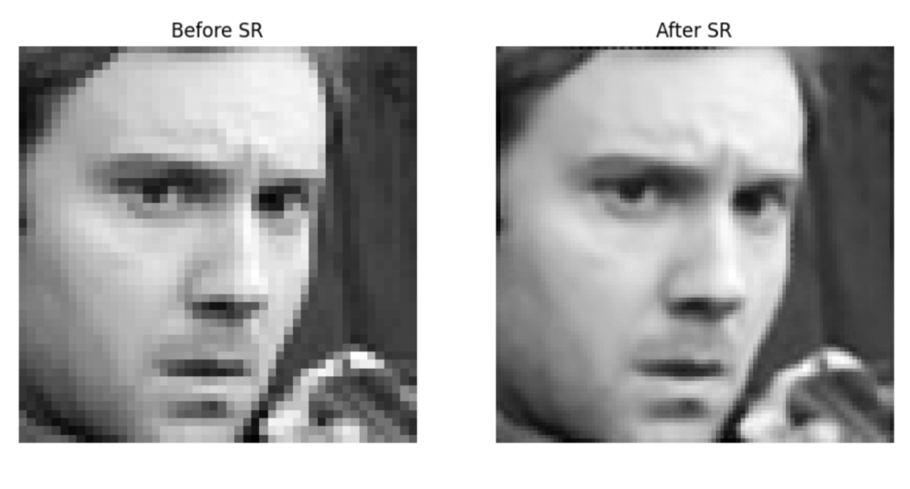

# Emotion Detection

### Introduction

The objective of this project was to use concepts learned during this course to build a deep neural network (DNN) designed for Facial Emotion Recognition (FER) and deploy the model in a user-friendly application. FER, a type of computer vision task, uses machine learning to classify emotional expressions in images of human faces. FER is an important area of study in the computer vision domain because it allows machines to perceive human emotional states, which can be applied to make interactions between humans and computers more meaningful, along with other applications such as customer service and security systems. 


### Dataset
The primary dataset used for this project was **FER2013**. FER2013 is one of the most popular datasets for the task of FER. It contains 35,887 48x48 grayscale images of faces expressing one of seven emotional expressions -  angry, disgust, fear, happy, sad, surprise, or neutral.  

3,944 additional grayscale facial expression images were extracted from a second auxiliary dataset (citation here) to add samples to the underrepresented classes (angry, disgust, fear, sad, surprise, and neutral) to improve model performance.

Due to imbalances and other image ambiguities, we apply a super-resolution technique using the 'LapSRN_x2' model, which upscales the images by a factor of 2, enhancing their resolution. This process involves converting images to 8-bit format before upscaling and then normalizing them post-enhancement. To further augment our dataset and improve model robustness, we apply several augmentation techniques, including random flipping, brightness adjustment, and contrast scaling.

<div style="text-align:center">
    
</div>


### Dependencies
- Python 3.11
- To install the required packages, run pip install -r requirements.txt.


### Usage

First, clone the repository and change the directory
```python
git clone https://github.com/julietlawton/emotion-recognition.git
cd web
```
<br>

Then, run the Streamlit application:
```python
streamlit run web/Static_Photo_Demo.py
```
